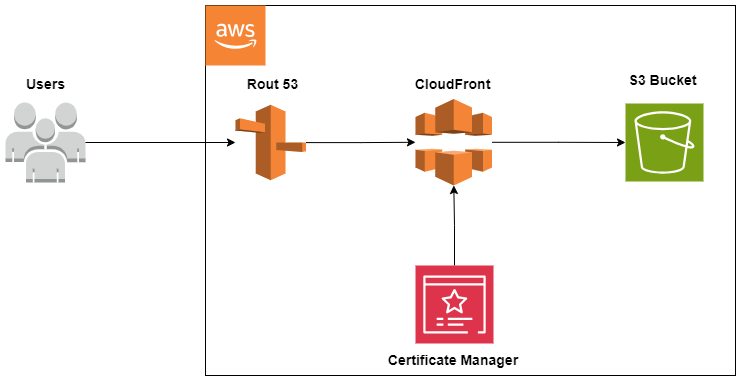

## About The Project

The web card is a simple static webpage what was made to be deployed in a different ways in order to get practical experience in web page deploying tools. The second and not last function is short representation of Gennady Jenichek`s studying process, practical experience and certification. Currently you can access the web page by address [http://gj85.eu](https://gj85.eu/)

## Project Structure

There following structure of the project:

- index.htmi - the web page html file
- error.html - the file appears when the index.html not reachable
- assets directory consists css style file, images and documents for downloading (CV)
- server_structure_terraform directory consist terraform configuration files
- into .github\workflows is possible to find following GitActions:
  - workflow for AWS structure automatic creation with Terraform
  - workflow for automatic content update. As regular content update appears after _git push_ command
  - workflow for automatic error.html file update

In the project realized IaC approach. The web page is hosted on [AWS](https://aws.amazon.com/) and all resources created and maintained with [Terraform](https://www.terraform.io/). Domain name was purchased to [https://eu.myzone.app/en](https://eu.myzone.app/en)

#### Software versions were used:

- Terraform v1.8.2
- AWS provider v5.49.0
- AWS CLI v2.15.42
- Python v3.11.8

#### The server structure:

The static files are stored on regular AWS S3 bucket. The bucket not configured as static website because that way of configuration not support SSL/TLS connection. To provide secure connection AWS CloudFront is used. The CloudFront is only available entry point to access the static content. Other ways to connect to the bucket are restricted. It is the second reason why regular bucket was chosen - for buckets configured to host static website, access only with CloudFront not possible. Domain name was purchased from side provider but is maintained by AWS Route53 resource. For secure domain name TLS certificate issued with Amazon Certificate Manager is used. All terraform.tfstate files are stored on private AWS S3 bucket.

Following diagram illustrates the AWS server structure:

